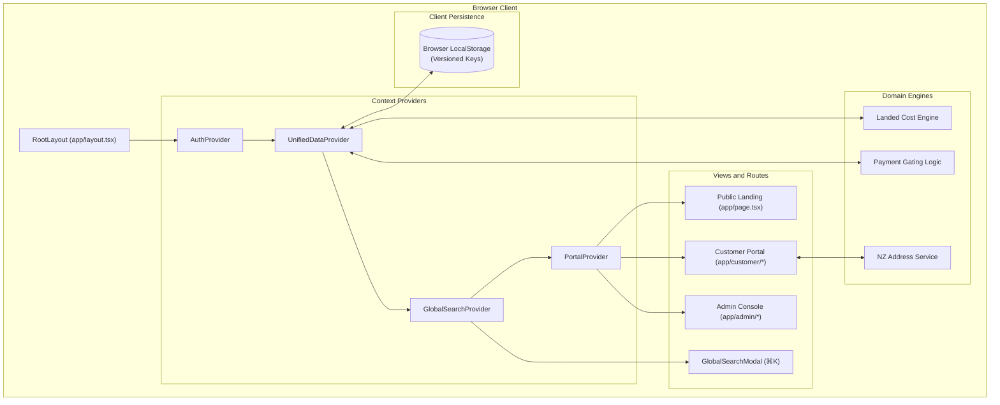
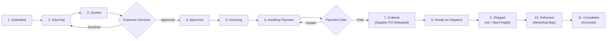

# JDMHub System Architecture (`Architecture.md`)

Welcome to the **JDMHub System Architecture** specification. This document outlines the high-level system design, runtime technology stack, domain pipelines, and directory structure that govern the JDMHub B2B automotive procurement platform.

---

## Table of Contents
1. [High-level Architecture](#1-high-level-architecture)
   - [System Overview & Domain Context](#system-overview--domain-context)
   - [Multi-Portal System Topology](#multi-portal-system-topology)
   - [Architectural Layers](#architectural-layers)
   - [Architecture Diagram](#architecture-diagram)
   - [End-to-End Procurement Lifecycle Pipeline](#end-to-end-procurement-lifecycle-pipeline)
   - [Business Logic & Gatekeeping Engines](#business-logic--gatekeeping-engines)
   - [Authentication & Role-Based Access Control (RBAC)](#authentication--role-based-access-control-rbac)
2. [Technology Stack](#2-technology-stack)
   - [Core Framework & Runtime](#core-framework--runtime)
   - [Styling & Design System Engine](#styling--design-system-engine)
   - [State Management & Data Layer](#state-management--data-layer)
   - [Iconography & Media](#iconography--media)
   - [Dependency Inventory](#dependency-inventory)
3. [Folder Structure](#3-folder-structure)
   - [Directory Tree](#directory-tree)
   - [Directory Breakdown & Module Responsibilities](#directory-breakdown--module-responsibilities)
     - [`app/` (Routing & Layouts)](#app-routing--layouts)
     - [`components/` (Component Taxonomy)](#components-component-taxonomy)
     - [`context/` (State Management & Providers)](#context-state-management--providers)
     - [`lib/` (Services, Mock Data & Utilities)](#lib-services-mock-data--utilities)
     - [`types/` (TypeScript Data Contracts)](#types-typescript-data-contracts)
     - [`public/` (Static Assets)](#public-static-assets)

---

## 1. High-level Architecture

### System Overview & Domain Context
**JDMHub** is a specialized B2B Automotive Procurement Platform engineered to bridge Japanese automotive parts suppliers, dismantlers, and auction houses with New Zealand workshops, dealerships, and trade mechanics.

The platform eliminates fragmented communication (scattered emails, uncoordinated supplier chat apps, manual spreadsheets) by providing:
- A unified single intake reference ID (`AH-P-XXXXXX`) across the entire procurement lifecycle.
- Full landed-cost calculation (FOB price, exchange rates, international sea/air freight, customs tariffs, local GST, trade margin).
- Real-time milestone tracking from Japanese warehouse collection to hoist bay delivery in NZ.
- A commercial gatekeeping workflow where Japanese supplier purchase orders (POs) are released only after trade customer payment clearance.

---

### Multi-Portal System Topology
The platform operates as a cohesive web application segmented into three primary interface surfaces:

```
                                  ┌────────────────────────┐
                                  │      JDMHub Entry      │
                                  │       (Root /)         │
                                  └───────────┬────────────┘
                                              │
                    ┌─────────────────────────┼─────────────────────────┐
                    │                         │                         │
                    ▼                         ▼                         ▼
         ┌─────────────────────┐   ┌─────────────────────┐   ┌─────────────────────┐
         │   Public Landing    │   │   Customer Trade    │   │  Internal Admin &   │
         │     & Marketing     │   │       Portal        │   │ Procurement Ops     │
         │         (/)         │   │    (/customer/*)    │   │     (/admin/*)      │
         └─────────────────────┘   └─────────────────────┘   └─────────────────────┘
```

1. **Public Marketing & Acquisition Surface (`/`)**:
   - Showcase value propositions, interactive quote calculator, trust metrics, and guest request intake.
2. **Customer Trade Portal (`/customer/*`)**:
   - Tailored for registered mechanics, fleet operators, and automotive workshops.
   - Self-service dashboard for part requests, interactive quote approvals, invoice settlements, tracking live consignments, and trade settings.
3. **Internal Admin & Procurement Workspace (`/admin/*`)**:
   - Dedicated back-office command center for procurement coordinators, inventory specialists, and finance staff.
   - Comprehensive request management workspace with dedicated tabs for sourcing, multi-supplier quote comparisons, landed-cost margin calculations, PO release, logistics dispatch, and invoice generation.

---

### Architectural Layers

The application is structured into four distinct runtime layers:

```
┌────────────────────────────────────────────────────────────────────────┐
│ 1. PRESENTATION LAYER (Next.js 14 App Router + Tailwind CSS)            │
│    - Public Landing Pages, Customer Portal Views, Admin Workspaces     │
│    - Reusable UI Primitives (Button, Input, Alert, StatusBadge)        │
│    - Global Modals (Quick Search ⌘K, Address Lookup, Invoices)         │
├────────────────────────────────────────────────────────────────────────┤
│ 2. STATE & CONTEXT ORCHESTRATION LAYER                                  │
│    - AuthProvider: Session state, active identity, mock role switching │
│    - UnifiedDataProvider: Canonical PartRequest store & status engine  │
│    - PortalProvider: Customer navigation, filter states, modal triggers│
│    - GlobalSearchProvider: Cross-portal command palette index          │
├────────────────────────────────────────────────────────────────────────┤
│ 3. BUSINESS LOGIC & DOMAIN ENGINES                                     │
│    - Landed Cost Calculation Engine (FOB + Freight + GST + Margins)    │
│    - Payment Gatekeeper (PO Release blocked until Payment = Paid)      │
│    - New Zealand Postal Address Resolution Service                     │
│    - Quote Acceptance Audit & Version Trail Engine                     │
├────────────────────────────────────────────────────────────────────────┤
│ 4. DATA & PERSISTENCE LAYER                                            │
│    - LocalStorage Reactive Sync (Versioned storage keys)               │
│    - Cross-tab Broadcast Channel synchronization                       │
│    - Canonical Seed Datasets (Shared mock requests, suppliers, staff)  │
└────────────────────────────────────────────────────────────────────────┘
```

---

### Architecture Diagram

The following Mermaid diagram visualizes the component relationships, context boundaries, and data synchronization channels:



---

### End-to-End Procurement Lifecycle Pipeline

Every part request transitions through an 11-stage canonical lifecycle mapped across the unified data store:



---

### Business Logic & Gatekeeping Engines

#### 1. Landed Cost Calculation Engine
Located in `components/admin/request-workspace/tabs/quote-tab.tsx` and `types/shared.ts`:
- **FOB Base (JPY / USD)**: Supplier parts invoice cost.
- **Freight Cost**: Dynamic calculation based on air freight (urgent 3–5 days) vs. consolidated sea container freight (bulk 14–21 days).
- **Tariff & Customs Duty**: Automotive part category classifications.
- **Import GST**: 15% New Zealand Goods and Services Tax applied across (FOB + Freight + Customs).
- **Trade Margin**: Configurable wholesale margin with automated markup recommendations.

#### 2. Strict Payment Gating Engine
Located in `context/unified-data-context.tsx`:
- Japanese supplier purchase orders cannot be dispatched until `paymentStatus === "Paid"`.
- If an admin attempts to transition an order into procurement without payment, the system flags the requirement or creates an invoice with live pulsing action reminders.

#### 3. New Zealand Address Resolution Service
Located in `lib/nz-address-service.ts`:
- Validates street addresses, suburbs, city boundaries, and 4-digit New Zealand postal codes for accurate courier delivery estimation.

#### 4. Quote Acceptance & Audit Trail Engine
- Tracks customer acceptance timestamps, IP simulation, authorized personnel name, and purchase order reference number for compliance and dispute prevention.

---

### Authentication & Role-Based Access Control (RBAC)

The application incorporates a flexible client-side authentication system (`context/auth-context.tsx`) supporting both trade customers and multi-role operations personnel.

| Role | Access Level | Primary Capabilities |
| :--- | :--- | :--- |
| **Trade Customer** | Customer Portal (`/customer/*`) | Submit requests, review quotes, approve/reject pricing, pay invoices, track consignments. |
| **Administrator** | Full Admin (`/admin/*`) | System-wide settings, user management, financial overrides, customer approvals. |
| **Procurement Staff** | Sourcing & Quotes | Add supplier quotations, compare Japanese vendor pricing, formulate customer quotes. |
| **Operations Staff** | Logistics & Tracking | Manage freight carriers, update shipment milestones, assign airway bill (AWB) numbers. |
| **Finance Staff** | Billing & Invoicing | Issue commercial tax invoices, reconcile bank deposits, mark payments as received. |

---

## 2. Technology Stack

JDMHub is constructed using a modern, type-safe web stack optimized for rapid rendering, minimal bundle footprints, and high developer productivity.

```
┌────────────────────────────────────────────────────────┐
│                    RUNTIME STACK                       │
├───────────────────────┬────────────────────────────────┤
│ Framework             │ Next.js 14.2.24 (App Router)   │
│ UI Library            │ React 18.3.1 / React DOM 18.3  │
│ Language              │ TypeScript 5.7.3               │
│ CSS Engine            │ Tailwind CSS 3.4.17            │
│ Post-Processor        │ PostCSS 8.5.2 & Autoprefixer   │
│ Iconography           │ Lucide React 0.475.0           │
│ Class Merging         │ clsx 2.1.1 + tailwind-merge 2.6│
│ Font Engine           │ next/font/google (Roboto)      │
└───────────────────────┴────────────────────────────────┘
```

### Core Framework & Runtime
- **Next.js 14 (App Router)**:
  - Leverages nested layouts (`layout.tsx`), client components (`"use client"`), and modular routing without external routing libraries.
  - Built-in metadata API for dynamic OpenGraph tags, responsive viewports, and tab title synchronization.
- **React 18**:
  - Leverages React concurrent features, hooks (`useMemo`, `useCallback`, `useContext`, `useRef`), and synthetic event handling.
- **TypeScript 5**:
  - Strict type checking (`strict: true` in `tsconfig.json`) across all data entities, component props, and API interfaces.

### Styling & Design System Engine
- **Tailwind CSS 3**:
  - Utility-first CSS configured with custom color tokens (`brand.red`, `brand.navy`, `brand.dark.*`).
  - Native CSS variable integration for dynamic runtime theming.
  - Zero-runtime CSS overhead for blazing-fast initial load times.
- **Tailwind Merge & Clsx**:
  - Combined into the unified `cn(...)` utility (`lib/utils.ts`) to resolve Tailwind utility conflicts cleanly.

### State Management & Data Layer
- **React Context API**:
  - Eliminates third-party state library bloat (Redux/Zustand) while providing clean reactive stores.
  - Scoped context providers prevent unnecessary root re-renders.
- **Versioned LocalStorage Layer**:
  - Ensures immediate persistence across browser reloads without requiring an external backend database during development or offline testing.

### Iconography & Media
- **Lucide React**:
  - Tree-shakeable SVG icons adhering to a standardized 24×24 visual grid.
- **SVG & Responsive Assets**:
  - Vector favicons, automotive trade logos, and custom technical part blueprints.

---

### Dependency Inventory

Extracted directly from `package.json`:

```json
{
  "dependencies": {
    "clsx": "^2.1.1",
    "lucide-react": "^0.475.0",
    "next": "^14.2.24",
    "react": "^18.3.1",
    "react-dom": "^18.3.1",
    "tailwind-merge": "^2.6.0"
  },
  "devDependencies": {
    "@types/node": "^20.17.19",
    "@types/react": "^18.3.18",
    "@types/react-dom": "^18.3.5",
    "autoprefixer": "^10.4.20",
    "postcss": "^8.5.2",
    "tailwindcss": "^3.4.17",
    "typescript": "^5.7.3"
  }
}
```

---

## 3. Folder Structure

### Directory Tree

```
jdmhub/
├── app/                              # Next.js 14 App Router root
│   ├── admin/                        # Internal Admin Console routes
│   │   ├── customers/                # Customer account management
│   │   ├── dashboard/                # Operational KPIs & metrics
│   │   ├── invoice/                  # Invoice generation & printing
│   │   ├── payments/                 # Billing reconciliation view
│   │   ├── requests/                 # Sourcing & procurement workspace
│   │   ├── settings/                 # Global system configuration
│   │   ├── shipments/                # Freight logistics tracking
│   │   ├── suppliers/                # Japanese vendor directory
│   │   ├── users/                    # Staff permissions & roles
│   │   ├── layout.tsx                # Admin chrome wrapper (Sidebar + Header)
│   │   └── page.tsx                  # Redirect to /admin/dashboard
│   ├── customer/                     # Customer Trade Portal routes
│   │   ├── dashboard/                # Customer overview & quick actions
│   │   ├── documents/                # Invoices, receipts & packing slips
│   │   ├── invoice/                  # Dedicated printable invoice route
│   │   ├── orders/                   # Active procurement orders
│   │   ├── payments/                 # Outstanding balance & receipts
│   │   ├── register/                 # Trade account onboarding
│   │   ├── requests/                 # Part request submission & history
│   │   ├── settings/                 # Workshop delivery & billing profile
│   │   ├── shipments/                # Live tracking with milestone stepper
│   │   ├── layout.tsx                # Customer portal chrome wrapper
│   │   └── page.tsx                  # Redirect to /customer/dashboard
│   ├── dashboard/                    # Legacy/Shortcut dashboard route
│   │   └── page.tsx
│   ├── login/                        # Authentication & role switcher
│   │   └── page.tsx
│   ├── register/                     # Public customer registration
│   │   └── page.tsx
│   ├── privacy/                      # Privacy policy legal page
│   │   └── page.tsx
│   ├── terms/                        # Terms of service legal page
│   │   └── page.tsx
│   ├── globals.css                   # Global CSS, Tailwind directives & tokens
│   ├── layout.tsx                    # Root HTML document & context providers
│   └── page.tsx                      # Public landing page
├── components/                       # UI Component Library
│   ├── admin/                        # Admin-specific UI components
│   │   ├── request-workspace/        # Deep procurement workspace
│   │   │   ├── tabs/                 # Sourcing, Quote, Invoice, Shipment tabs
│   │   │   └── request-detail-workspace.tsx
│   │   ├── views/                    # Full-page admin view controllers
│   │   ├── admin-header.tsx          # Frosted header with notifications & search
│   │   ├── admin-sidebar.tsx         # Dark navigation sidebar
│   │   ├── notification-popover.tsx  # Admin notification dropdown
│   │   └── status-badge.tsx          # Status, payment & milestone badges
│   ├── auth/                         # Authentication & login widgets
│   ├── landing/                      # Landing page section components
│   │   ├── hero-section.tsx          # Hero banner with primary CTA
│   │   ├── how-it-works-section.tsx  # 3-step procurement workflow
│   │   ├── interactive-request-modal.tsx # Quick part intake modal
│   │   ├── less-chasing-section.tsx  # "Before vs After" workflow showcase
│   │   ├── quote-freight-section.tsx # Interactive landed cost calculator
│   │   ├── track-request-section.tsx # Reference number live lookup demo
│   │   ├── trust-metrics-section.tsx # Social proof & reliability stats
│   │   ├── value-proposition-section.tsx # Trade benefits grid
│   │   ├── landing-header.tsx        # Sticky landing navigation bar
│   │   └── landing-footer.tsx        # Footer with links & legal info
│   ├── portal/                       # Customer Portal UI components
│   │   ├── customer-portal-layout.tsx# Main responsive portal layout wrapper
│   │   ├── dashboard-view.tsx        # Customer metrics & recent requests
│   │   ├── documents-view.tsx        # Document repository
│   │   ├── new-request-modal.tsx     # Multi-step part request dialog
│   │   ├── new-request-page.tsx      # Standalone request creation page
│   │   ├── notification-center.tsx   # Customer notification bell popover
│   │   ├── nz-address-lookup.tsx     # New Zealand postal address widget
│   │   ├── orders-view.tsx           # Order tracking table
│   │   ├── payment-modal.tsx         # Direct invoice payment dialog
│   │   ├── payments-view.tsx         # Billing history and balances
│   │   ├── portal-header.tsx         # Customer header with ⌘K search trigger
│   │   ├── portal-sidebar.tsx        # Customer navigation sidebar
│   │   ├── request-details-modal.tsx # Comprehensive request review dialog
│   │   ├── requests-view.tsx         # Customer requests management table
│   │   ├── settings-view.tsx         # Workshop profile settings
│   │   └── shipments-view.tsx        # Consignment milestone tracking
│   ├── shared/                       # Cross-portal reusable components
│   │   ├── global-search-modal.tsx   # ⌘K command palette overlay
│   │   └── invoice-document.tsx      # Printable GST tax invoice component
│   └── ui/                           # Atomic design primitives
│       ├── alert.tsx                 # Alert notices (Error, Warning, Success)
│       ├── button.tsx                # Variant-driven button component
│       └── input.tsx                 # Form input with icon slots & error text
├── context/                          # Global React Context state stores
│   ├── auth-context.tsx              # User authentication & role switching
│   ├── global-search-context.tsx     # Global ⌘K search modal visibility & query
│   ├── portal-context.tsx            # Customer portal navigation & active tabs
│   └── unified-data-context.tsx      # Central canonical store for requests & orders
├── lib/                              # Utility functions, services & mock datasets
│   ├── default-images.ts             # Fallback vehicle & component imagery
│   ├── mock-auth.ts                  # Mock trade customers & staff identities
│   ├── mock-portal-data.ts           # Customer portal seed dataset
│   ├── nz-address-service.ts         # New Zealand address autocomplete engine
│   ├── shared-mock-data.ts           # Initial requests, suppliers & notifications
│   ├── status-styles.ts              # Canonical color & badge class mappings
│   └── utils.ts                      # Classname merger helper (cn)
├── public/                           # Public static web assets
│   ├── images/                       # Marketing and automotive pictures
│   ├── default-part.svg              # Fallback graphic for missing part photos
│   ├── favicon.ico                   # Standard browser favicon
│   ├── favicon.svg                   # Scalable vector favicon
│   ├── apple-touch-icon.png          # iOS home screen web clip icon
│   └── Powered-by-autohub.png        # Official logistics partner emblem
├── types/                            # TypeScript type definitions & interfaces
│   ├── admin.ts                      # Admin dashboard metrics & settings types
│   ├── auth.ts                       # User, session, and role interfaces
│   ├── portal.ts                     # Customer portal tab navigation types
│   └── shared.ts                     # Canonical domain models (PartRequest, etc.)
├── .gitignore                        # Git exclusion rules
├── README.md                         # Primary project documentation & quickstart
├── PRD.md                            # Product Requirements Document
├── Architecture.md                   # System architecture documentation (This file)
├── DESIGN.md                         # Design system specifications
├── Rules.md                          # Mandatory engineering rules & coding standards
├── Memory.md                         # Living project memory & historical state
├── next.config.mjs                   # Next.js framework configuration
├── package.json                      # NPM dependencies & lifecycle scripts
├── postcss.config.mjs                # PostCSS plugins config
├── tailwind.config.ts                # Tailwind design system tokens & theme
└── tsconfig.json                     # TypeScript compiler configuration
```

---

### Directory Breakdown & Module Responsibilities

#### `app/` (Routing & Layouts)
Uses the Next.js 14 App Router convention. Every folder with a `page.tsx` represents a distinct URL route.
- `layout.tsx` is the top-level root document wrapping the application with `<AuthProvider>`, `<UnifiedDataProvider>`, and `<GlobalSearchProvider>`.
- `admin/` contains nested sub-routes restricted to internal operational workflows.
- `customer/` contains nested sub-routes providing trade clients self-service visibility.
- `globals.css` injects Tailwind base layers, font declarations, and custom scrollbar rules.

#### `components/` (Component Taxonomy)
Divided strictly by domain responsibility:
- **`components/ui/`**: Low-level atomic primitives (`Button`, `Input`, `Alert`) with zero domain dependencies.
- **`components/shared/`**: Composite components utilized across multiple portals (`GlobalSearchModal`, `InvoiceDocument`).
- **`components/landing/`**: Pure marketing and lead-generation sections used on the public index.
- **`components/portal/`**: Customer-facing workflows including multi-step part creation, invoice payment, and tracking.
- **`components/admin/`**: Operations-facing consoles, featuring the 8-tab procurement workspace (`request-workspace/tabs/*`).

#### `context/` (State Management & Providers)
- **`UnifiedDataProvider`** (`context/unified-data-context.tsx`):
  - Serves as the central state engine.
  - Maintains arrays for `requests`, `customers`, `suppliers`, `staffUsers`, and `notifications`.
  - Dispatches domain mutations (`submitCustomerRequest`, `addSupplierQuotation`, `createCustomerQuote`, `acceptCustomerQuote`, `markPaymentPaid`, `placeSupplierOrder`).
- **`AuthProvider`** (`context/auth-context.tsx`):
  - Manages active user identity and provides quick role switching for testing different permission tiers.
- **`GlobalSearchProvider`** (`context/global-search-context.tsx`):
  - Manages global search dialog visibility, active indices, and keyboard listeners.

#### `lib/` (Services, Mock Data & Utilities)
- **`status-styles.ts`**: The single source of truth for all badge colors, dot indicators, and border styles.
- **`nz-address-service.ts`**: Provides autocomplete algorithms for New Zealand addresses and postal code validation.
- **`utils.ts`**: Exports the standard `cn(...)` utility helper.
- **`shared-mock-data.ts`**: Houses realistic automotive mock data (Nissan Skyline BNR32, Toyota Supra JZA80, Mazda RX-7 FD3S parts) used to seed the client stores.

#### `types/` (TypeScript Data Contracts)
- **`shared.ts`**: Contains the canonical domain models:
  - `PartRequest`: Complete request lifecycle entity.
  - `SupplierQuotation`: Vendor pricing, conditions, and shipping quotes.
  - `CostCalculation`: Landed cost breakdown.
  - `ShipmentMilestone`: Physical freight transit steps.
- **`admin.ts`**: KPI counters, metrics aggregators, and system configuration types.
- **`auth.ts`**: User credentials, staff roles, and authentication context signatures.
- **`portal.ts`**: Navigation tab definitions and portal-specific UI filters.

#### `public/` (Static Assets)
Hosts static media served directly by Next.js at the root path (`/`), including favicons, automotive technical illustrations, and partner logos.

---

## 4. Architectural Best Practices

1. **Strict Type Safety**: All state actions and components must use explicit TypeScript types from `@/types/*` rather than `any`.
2. **Canonical Status Flow**: Never update a request status arbitrarily; always use the status workflow methods defined in `UnifiedDataProvider`.
3. **Single Landed Cost Formula**: Always calculate landed prices via the standardized formula (FOB + Freight + Customs Duty + GST + Margin) to prevent quoting discrepancies.
4. **Responsive Integrity**: Ensure every view adapts smoothly between mobile screens (`< 640px`), tablets (`640px - 1024px`), and desktop displays (`> 1024px`).
