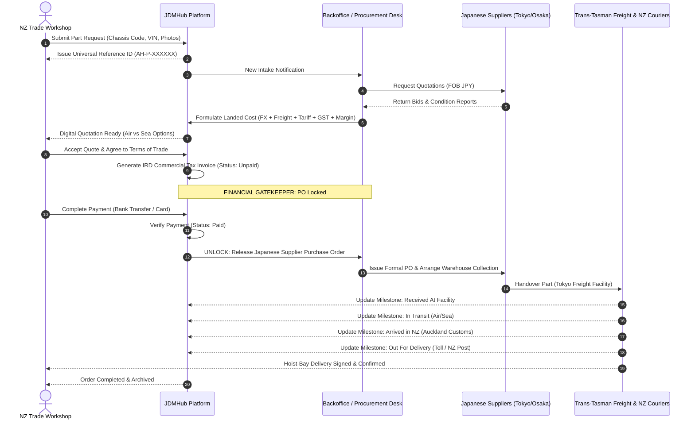

# JDMHub — B2B Automotive Procurement Platform

[](https://nextjs.org/)
[](https://react.dev/)
[](https://www.typescriptlang.org/)
[](https://tailwindcss.com/)
[]()
[]()

> **JDMHub** is an enterprise-grade B2B cross-border automotive procurement platform designed to bridge Japanese automotive parts suppliers, dismantlers, and auction houses with New Zealand workshops, dealerships, and trade mechanics.

---

## Table of Contents

- [Executive Summary](#executive-summary)
- [The Cross-Border Procurement Challenge](#the-cross-border-procurement-challenge)
- [Core Platform Capabilities](#core-platform-capabilities)
  - [1. Single Universal Intake Identifier (`AH-P-XXXXXX`)](#1-single-universal-intake-identifier-ah-p-xxxxxx)
  - [2. Dynamic Landed-Cost & FX Formulator](#2-dynamic-landed-cost--fx-formulator)
  - [3. Commercial Payment Gatekeeping](#3-commercial-payment-gatekeeping)
  - [4. Multi-Persona Role-Based Access Control (RBAC)](#4-multi-persona-role-based-access-control-rbac)
  - [5. 5-Stage Cross-Border Milestone Tracking](#5-5-stage-cross-border-milestone-tracking)
  - [6. NZ Trade Verification & Address Engine](#6-nz-trade-verification--address-engine)
  - [7. Universal Command Palette (`⌘K` / `Ctrl+K`)](#7-universal-command-palette-k--ctrlk)
- [Multi-Surface Portal Architecture](#multi-surface-portal-architecture)
  - [Public Marketing Portal (`/`)](#public-marketing-portal-)
  - [Authentication & Onboarding (`/login`, `/register`)](#authentication--onboarding-login-register)
  - [Trade Customer Portal (`/customer/*`)](#trade-customer-portal-customer)
  - [Backoffice Operations Console (`/admin/*`)](#backoffice-operations-console-admin)
- [End-to-End Procurement Lifecycle](#end-to-end-procurement-lifecycle)
- [Technology Stack](#technology-stack)
- [Directory Structure](#directory-structure)
- [Getting Started](#getting-started)
  - [Prerequisites](#prerequisites)
  - [Installation](#installation)
  - [Running the Development Server](#running-the-development-server)
  - [Building for Production](#building-for-production)
  - [Available Scripts](#available-scripts)
- [Demo Personas & Test Credentials](#demo-personas--test-credentials)
- [Project Documentation & Governance](#project-documentation--governance)
- [Enterprise Production Roadmap](#enterprise-production-roadmap)
- [License & Support](#license--support)

---

## Executive Summary

Sourcing rare Japanese domestic market (JDM) performance components, genuine OEM replacement parts, and heavy assemblies (engines, transmissions, body cuts) for New Zealand automotive workshops is traditionally fragmented, high-risk, and opaque. 

Workshops frequently contend with uncoordinated supplier messaging apps, manual spreadsheets, fluctuating JPY-to-NZD currency rates, unexpected customs duties at the Port of Auckland, fitment disputes, and long logistics blindspots.

**JDMHub** solves this with an integrated, full-lifecycle digital procurement system:
- **Zero Financial Leakage**: Japanese supplier purchase orders are only released once customer payment is cleared.
- **Complete Transparency**: Full landed cost breakdown (FOB price, exchange rates, sea/air freight, customs tariffs, 15% NZ GST, and margin).
- **Hoisting Bay Delivery**: Direct milestone visibility from Japanese warehouse pick-up to New Zealand workshop bay arrival.

---

## The Cross-Border Procurement Challenge

```
TRADITIONAL SOURCING (FRAGMENTED & HIGH RISK)
Workshop Tech ──> Scattered WhatsApp/LINE ──> Manual Quotes (JPY) ──> Hidden Customs/GST Shock ──> Logistics Blindspot ──> Bay Delay

JDMHUB UNIFIED PROCUREMENT ENGINE
Workshop Tech ──> Intake (AH-P-XXXXXX) ──> Tokyo Supplier Desk ──> Landed-Cost (NZD) ──> Gatekeeper ──> 5-Stage Live Milestones ──> Bay Arrival
```

| Friction Point | Traditional Channel | JDMHub Solution |
| :--- | :--- | :--- |
| **Communication** | Scattered emails, LINE, WhatsApp, WeChat | Single Universal Reference ID (`AH-P-XXXXXX`) across all channels |
| **Cost Predictability** | Raw JPY quotes with unexpected shipping & import duty bills | Automated Landed-Cost calculation in NZD inclusive of 15% GST and tariffs |
| **Financial Exposure** | Upfront supplier payments prior to customer commitment | Strict payment gatekeeping: POs release strictly upon invoice clearance |
| **Fitment Accuracy** | Verbal descriptions with high return rates | Mandatory Chassis Code (`BNR34`, `FD3S`), VIN, Engine, and photo intake |
| **Logistics Visibility**| "It's on the boat" with zero intermediate status updates | 5-stage milestone tracking from Japanese facility to NZ workshop hoist-bay |

---

## Core Platform Capabilities

### 1. Single Universal Intake Identifier (`AH-P-XXXXXX`)
Every vehicle part requirement originates with an immutable, universal reference code (e.g., `AutoHub-P-101`, `AH-P-884920`). This single token remains consistent across:
- Customer intake wizard
- Internal backoffice sourcing desk
- Japanese supplier bid comparison
- Landed-cost formulation
- New Zealand IRD-compliant commercial tax invoices
- International Airway Bills (AWB) and domestic NZ courier tracking

### 2. Dynamic Landed-Cost & FX Formulator
The platform features an automated currency conversion and landed-cost calculation engine:
$$\text{Customer Landed Cost} = (\text{Supplier FOB [JPY]} \times \text{FX Rate}) + \text{Freight} + \text{Customs} + \text{Margin} + \text{15\% GST}$$
Workshops choose between **Air Express** (3–7 business days) or **Consolidated Ocean Freight** (18–25 business days) with transparent pricing before committing.

### 3. Commercial Payment Gatekeeping
To eliminate financial leakage and bad debt, the platform enforces a strict architectural invariant:
> **Core Invariant**: No Japanese supplier Purchase Order (PO) can be released or confirmed until the customer payment status is validated as `"Paid"`.
Backoffice dispatch and PO buttons remain locked and disabled until finance clears the transaction.

### 4. Multi-Persona Role-Based Access Control (RBAC)
Includes a simulated multi-role switcher allowing instant testing across 5 realistic personas:
1. **Trade Customer**: Independent mechanics, workshop owners, and fleet managers.
2. **Administrator / Managing Director**: Full oversight of platform metrics, approvals, and margins.
3. **Procurement Specialist (Tokyo Desk)**: Supplier bids, condition grading, and Japanese dismantler liaison.
4. **Operations Controller (Auckland Hub)**: Freight logistics, customs clearance, and domestic carrier dispatch.
5. **Finance Controller**: Commercial invoice issuance, GST reconciliation, and payment verification.

### 5. 5-Stage Cross-Border Milestone Tracking
Shipments progress through five distinct, auditable physical milestones:
1. `Received At Shipping Facility` (Tokyo / Osaka / Nagoya consolidator)
2. `In Transit` (International air freight or sea container vessel)
3. `Arrived in NZ` (Port of Auckland / Auckland Airport Customs clearance)
4. `Out For Delivery` (Domestic freight via Toll NZ / NZ Post / Mainfreight)
5. `Delivered` (Signed hoist-bay delivery at customer workshop)

### 6. NZ Trade Verification & Address Engine
Incorporates New Zealand Business Number (NZBN) verification checks, trade reference validation, and address resolution with 4-digit NZ postal codes (`lib/nz-address-service.ts`) for precise freight estimation.

### 7. Universal Command Palette (`⌘K` / `Ctrl+K`)
Global keyboard-first search modal (`components/shared/global-search-modal.tsx`) indexing all part requests, customers, Japanese suppliers, vehicles, and invoices with instant navigation shortcuts.

---

## Multi-Surface Portal Architecture

JDMHub is organized into four synchronized surfaces powered by a shared data layer:

```
┌────────────────────────────────────────────────────────────────────────┐
│                        JDMHUB PLATFORM SURFACES                        │
├───────────────────┬────────────────────────────────────────────────────┤
│ Public Marketing  │ `/` • `/terms` • `/privacy`                        │
│ Surface           │ Interactive quote calculator, trust metrics, modal  │
├───────────────────┼────────────────────────────────────────────────────┤
│ Auth & Onboarding │ `/login` • `/register`                             │
│ Surface           │ Persona switching, NZ trade verification, NZBN     │
├───────────────────┼────────────────────────────────────────────────────┤
│ Trade Customer    │ `/customer/dashboard` • `/customer/requests`       │
│ Portal            │ `/customer/invoice`   • `/customer/payments`       │
│                   │ `/customer/shipments` • `/customer/settings`       │
├───────────────────┼────────────────────────────────────────────────────┤
│ Backoffice Admin  │ `/admin/dashboard` • `/admin/requests`             │
│ Console           │ `/admin/suppliers` • `/admin/customers`            │
│                   │ `/admin/payments`  • `/admin/shipments`            │
└───────────────────┴────────────────────────────────────────────────────┘
```

### Public Marketing Portal (`/`)
- **Hero & Part Search**: High-impact automotive branding with instant intake modal launcher.
- **Trust & Verification Metrics**: Real-time stats showcasing 99.4% fitment accuracy and 48-hour fitment guarantee.
- **Interactive Freight Calculator**: Live estimator comparing Air Express vs. Ocean Sea Freight for typical JDM part categories.
- **Sourcing Journey Showcase**: Visual step-by-step explainer from Japanese auction houses to NZ workshops.

### Authentication & Onboarding (`/login`, `/register`)
- **Quick-Switch Persona Dock**: Immediate switching between Customer, Procurement, Operations, and Admin roles without manual credentials.
- **Workshop Registration**: Multi-step onboarding collecting trading name, NZBN, workshop physical address, and trade references.
- **Terms of Trade & Privacy Modals**: Integrated legal compliance modals for digital terms acceptance.

### Trade Customer Portal (`/customer/*`)
- **Customer Dashboard**: Overview of active orders, quotes awaiting approval, in-transit deliveries, and total spend.
- **Technical Part Intake Wizard**: Vehicle selector (Year, Make, Model, VIN/Chassis, Engine, Transmission), part specification (OEM part number, condition grade, urgency tier), and photo uploads.
- **Digital Quote Acceptance Modal**: Detailed landed-cost breakdown in NZD, Air vs. Sea freight selection, digital terms sign-off, and one-click quote acceptance or rejection.
- **Commercial Invoicing & Payments**: IRD-compliant GST tax invoice viewer (`components/shared/invoice-document.tsx`), bank transfer instructions, and simulated instant card payment gateway.
- **Live Consignment Tracker**: Visual 5-stage progress stepper with international AWB numbers and domestic courier links.
- **Workshop Delivery Addresses**: Address book with verified NZ postal code lookup and custom bay delivery instructions.

### Backoffice Operations Console (`/admin/*`)
- **Operations Dashboard**: Sourcing queue counters, pending PO liabilities, financial turnover, and customs clearance alerts.
- **Unified Request Workspace**: Deep 8-tab operational command center:
  - `Overview Tab`: Vehicle chassis code, engine specs, customer contact, and urgency tags.
  - `Sourcing Tab`: Japanese dismantler bid entry (Tokyo, Osaka, Nagoya) in JPY FOB with condition photos.
  - `Quote Tab`: Margin adjusters, landed-cost formula calculation, and quote publishing controls.
  - `Invoice Tab`: Commercial invoice issuance and GST calculation preview.
  - `Payment Tab`: Payment verification gatekeeper with automated unlock triggers.
  - `Shipment Tab`: Carrier assignment, tracking number entry, and milestone advancement controls.
  - `Documents Tab`: Export certificates, Japanese de-registration sheets, and bills of lading.
  - `Activity Tab`: Immutable audit trail tracking all actions, timestamps, and staff actors.
- **Supplier Directory**: Japanese supplier catalog with rating scores, specialties (Half-cuts, Engines, Carbon panels), and contact records.
- **Trade Customer Management**: Workshop approval queue, credit limits, account status (`Active`, `Pending`, `Suspended`).

---

## End-to-End Procurement Lifecycle



---

## Technology Stack

| Layer | Technology | Version | Purpose |
| :--- | :--- | :--- | :--- |
| **Framework** | [Next.js](https://nextjs.org/) | `^14.2.24` | App Router, server layouts, dynamic segment routing, and asset optimization |
| **UI Runtime** | [React](https://react.dev/) | `^18.3.1` | Concurrent rendering, custom hooks, and Context API |
| **Language** | [TypeScript](https://www.typescriptlang.org/) | `^5.7.3` | Strict type safety (`strict: true`), zero untyped `any` contracts |
| **Styling** | [Tailwind CSS](https://tailwindcss.com/) | `^3.4.17` | Utility-first styling with custom dark automotive design tokens |
| **Utility** | `clsx` + `tailwind-merge` | `^2.1.1` / `^2.6.0` | Conflict-free CSS class composition via `cn(...)` utility |
| **Icons** | [Lucide React](https://lucide.dev/) | `^0.475.0` | Comprehensive automotive and logistics SVG iconography |
| **State & Persistence** | React Context + LocalStorage | Native | Multi-context state layer with defensive JSON hydration and fallback |

---

## Directory Structure

```
jdmhub/
├── app/                              # Next.js 14 App Router
│   ├── (auth)/                       # Authentication & Onboarding
│   │   ├── login/page.tsx            # Multi-persona login & simulation
│   │   └── register/page.tsx         # Trade workshop registration & NZBN
│   ├── admin/                        # Backoffice Operations Console
│   │   ├── layout.tsx                # Admin chrome, sidebar & header
│   │   ├── dashboard/                # Sourcing KPIs & operational metrics
│   │   ├── requests/                 # Deep request workspace (8 tabs)
│   │   ├── suppliers/                # Japanese supplier directory
│   │   ├── customers/                # Trade workshop verification queue
│   │   ├── payments/                 # Commercial finance & GST reconciliation
│   │   └── shipments/                # Freight logistics & milestone controls
│   ├── customer/                     # Trade Customer Self-Service Portal
│   │   ├── layout.tsx                # Customer portal chrome & navigation
│   │   ├── dashboard/                # Workshop activity & pending quotes
│   │   ├── requests/                 # Technical part intake wizard
│   │   ├── payments/                 # Tax invoices & payment simulator
│   │   ├── shipments/                # 5-stage milestone consignment tracking
│   │   └── settings/                 # NZ delivery addresses & trade profile
│   ├── globals.css                   # Tailwind tokens, automotive dark palette
│   ├── layout.tsx                    # Root layout & context providers
│   ├── page.tsx                      # Public marketing landing page
│   ├── privacy/                      # NZ Privacy Act 2020 legal notice
│   └── terms/                        # B2B Terms of Trade legal contract
├── components/                       # Modular UI Components
│   ├── admin/                        # Backoffice views, header & request workspace
│   ├── auth/                         # Multi-role switchers, legal modals
│   ├── landing/                      # Landing hero, trust metrics, freight calculator
│   ├── portal/                       # Customer portal views, request modals
│   ├── shared/                       # Global search (⌘K), printable tax invoice
│   └── ui/                           # Button, Input, Modal, Badges, Tabs
├── context/                          # State Management
│   ├── auth-context.tsx              # User authentication & active persona
│   ├── global-search-context.tsx     # Command palette keyboard listener
│   ├── portal-context.tsx            # Legacy portal provider
│   └── unified-data-context.tsx      # Master requests, quotes, payments, shipments
├── lib/                              # Services & Utilities
│   ├── default-images.ts             # Curated automotive component imagery
│   ├── mock-auth.ts                  # Persona profiles & default accounts
│   ├── mock-portal-data.ts           # Initial requests, invoices & tracking events
│   ├── nz-address-service.ts         # NZ postal code & address verification engine
│   ├── shared-mock-data.ts           # Comprehensive seed dataset
│   ├── status-styles.ts              # Semantic badge color mappings
│   └── utils.ts                      # `cn(...)` classnames merger
├── public/                           # Static assets, branding, and imagery
│   ├── images/                       # High-res photography & journey graphics
│   └── favicon.ico                   # Automotive hub branding icons
├── types/                            # Canonical TypeScript Contracts
│   ├── admin.ts                      # Admin console types
│   ├── auth.ts                       # User, session, and role types
│   ├── portal.ts                     # Portal filter & response contracts
│   └── shared.ts                     # PartRequest, Quotation, Payment, Shipment
├── Architecture.md                   # System Architecture Specification
├── DESIGN.md                         # Design System & UI Specification
├── Memory.md                         # Living Project Memory & Status
├── package.json                      # Dependencies & NPM scripts
├── PRD.md                            # Product Requirements Document
├── Rules.md                          # Mandatory Engineering Rules
├── tailwind.config.ts                # Tailwind theme customization
└── tsconfig.json                     # TypeScript strict configuration
```

---

## Getting Started

### Prerequisites
- **Node.js**: `v18.17.0` or higher (Node 20+ recommended)
- **npm**: `v9.0.0` or higher (or `pnpm` / `yarn`)
- **Git**: Installed and configured

### Installation
Clone the repository and install project dependencies:

```bash
# Clone the repository
git clone https://github.com/anilfolio/jdmhub.git

# Navigate into the project directory
cd jdmhub

# Install dependencies cleanly
npm install
```

### Running the Development Server
Launch the local development environment:

```bash
npm run dev
```

Open [http://localhost:3000](http://localhost:3000) in your browser. The application is hot-reloaded and pre-seeded with sample data.

### Building for Production
Validate types, build optimized production bundles, and verify runtime output:

```bash
# Compile and create production build
npm run build

# Start the optimized production server
npm run start
```

### Available Scripts

| Command | Action |
| :--- | :--- |
| `npm run dev` | Starts the Next.js development server at `http://localhost:3000` |
| `npm run build` | Compiles TypeScript and creates an optimized production bundle in `.next` |
| `npm run start` | Boots the compiled Next.js production server |
| `npm run lint` | Runs ESLint analysis across all source files |

---

## Demo Personas & Test Credentials

The application includes an instant **Role-Based Persona Switcher** accessible directly from the login page (`/login`) or the application header:

| Persona | Name | Role | Email | Scope of Access |
| :--- | :--- | :--- | :--- | :--- |
| **Trade Customer** | **James Wilson** | Customer | `james.wilson@spmotors.co.nz` | Access to `/customer/*`: Part requests, quote acceptance, invoices, and shipment tracking |
| **Procurement Desk** | **Sarah Jenkins** | Staff (`Procurement`) | `sarah.jenkins@JDMHUB.io` | Access to `/admin/*`: Japanese supplier bid entry, quote formulation, and part sourcing |
| **Managing Director** | **David Vance** | Staff (`Administrator`)| `david.vance@JDMHUB.io` | Access to `/admin/*`: System-wide access, margin overrides, customer approvals, and audit logs |
| **Operations Hub** | **Elena Rodriguez** | Staff (`Operations`) | `elena.rodriguez@JDMHUB.io` | Access to `/admin/*`: Freight carrier assignment, customs release, and milestone advancement |

*Note: All authentication is simulated client-side for zero-friction testing. Selecting a persona instantly sets the active user and hydrates appropriate permissions.*

---

## Project Documentation & Governance

The repository maintains an institutional-grade documentation suite. All contributors and maintainers must review these documents before committing changes:

| Document | Purpose & Contents | Link |
| :--- | :--- | :--- |
| **`PRD.md`** | **Product Requirements Document**: Market pain points, persona profiles, functional requirements, and success metrics. | [PRD.md](file:///f:/Project-Personal-Portfolio/jdmhub/PRD.md) |
| **`Architecture.md`** | **System Architecture Specification**: Multi-portal topology, data models, state management, and directory layout. | [Architecture.md](file:///f:/Project-Personal-Portfolio/jdmhub/Architecture.md) |
| **`DESIGN.md`** | **Design System Specifications**: Dark automotive color tokens, typographic scale, UI primitives, and design philosophy. | [DESIGN.md](file:///f:/Project-Personal-Portfolio/jdmhub/DESIGN.md) |
| **`Rules.md`** | **Mandatory Engineering Rules**: Coding standards, strict TypeScript guidelines, and problem boundary enforcement. | [Rules.md](file:///f:/Project-Personal-Portfolio/jdmhub/Rules.md) |
| **`Memory.md`** | **Living Project Memory**: Historical record of completed milestones, in-flight work, and sprint backlog. | [Memory.md](file:///f:/Project-Personal-Portfolio/jdmhub/Memory.md) |

---

## Enterprise Production Roadmap

To transition JDMHub from client-side simulation to production-grade enterprise deployment, the following phases are scheduled:

1. **Relational Database & Multi-Tenant RLS**:
   - Migration from `localStorage` to **PostgreSQL** (via Supabase or Prisma).
   - Implementation of Row-Level Security (RLS) isolating trade workshop records.
2. **Production Payment Gateway**:
   - Integration of **Stripe New Zealand** for direct credit card processing.
   - Support for **POLi / NZ Bank Direct Credit** with automated webhook payment reconciliation.
3. **Logistics & Freight APIs**:
   - Live API webhooks from **Toll New Zealand**, **NZ Post**, **Mainfreight**, and **DHL Express** for automated milestone progression.
4. **Japanese Auction & Dismantler Integrations**:
   - Automated data feeds connecting **USS**, **ARAI**, and **Yahoo Japan Auctions** for real-time parts availability and historical pricing.

---

## License & Support

This project is proprietary and confidential. All rights reserved.

- **Developer / Maintainer**: JDMHub Engineering Team
- **Region**: Auckland, New Zealand & Tokyo, Japan
- **Support Contact**: `support@jdmhub.co.nz`
